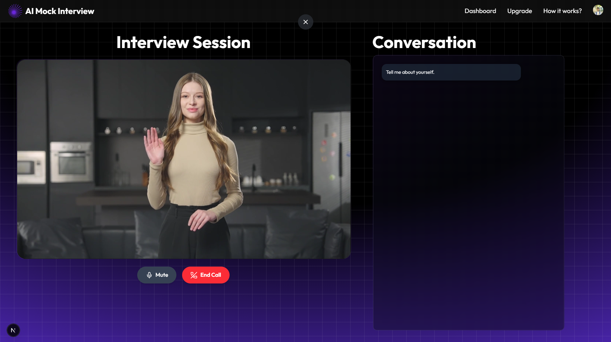
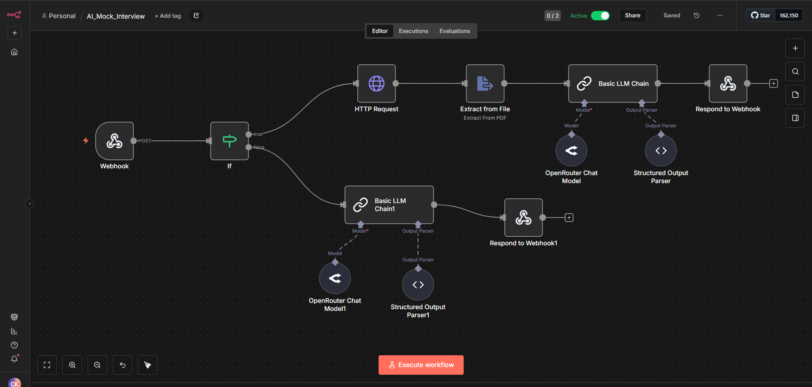

# 🚀 AI Mock Interview

AI Mock Interview is a full-featured web application that simulates real technical interviews using **AI-driven avatars, resume analysis, and automated feedback generation**.  
It helps users practice interviews, improve confidence, and track progress — all inside a beautifully redesigned UI.

---

## 🌟 Features

### 🤖 AI Mock Interview System
- Real-time interview simulation  
- Dynamic AI-generated questions  
- Automated scoring & feedback  
- Scenario-based interview sessions  

### 🎨 Fully Redesigned UI (Custom Version)
- Modern landing page  
- New dashboard, navbar, and footer  
- Smooth animations and transitions  
- Fully responsive for all devices  

### 📄 Resume Preview & Analysis
- Upload and view resume directly in the app  
- AI analyzes resume before generating questions  
- Helps prepare for real job interviews  

### 🧠 AI Avatar (Akool Streaming Avatar)
- Realistic face & voice interaction  
- Natural conversational experience  
- Users feel like talking to a real interviewer  

### 📡 n8n Automation Workflows
- **Workflow 1:** AI Question Generator  
- **Workflow 2:** Interview Feedback Generator  
- Both use LLMs to generate structured outputs  

---

## 🛠️ Tech Stack

| Category | Technology |
|----------|------------|
| Frontend | Next.js, React, Tailwind CSS |
| Backend | Convex |
| Authentication | Clerk |
| Automation | n8n |
| AI Services | OpenRouter (LLMs), Akool Avatar |
| Styling | Tailwind + Custom Animations |

---

## ⚙️ Installation

# 1️⃣ Clone the repository

```bash
git clone https://github.com/your-username/ai-mock-interview.git
cd ai-mock-interview
```

---

# 2️⃣ Install dependencies

```bash
npm install
```

---

# 3️⃣ Add Environment Variables

Create a file named:

```
.env.local
```

Add:

```env
NEXT_PUBLIC_CLERK_PUBLISHABLE_KEY=
CLERK_SECRET_KEY=
```
---
## Clerk Authentication
```
NEXT_PUBLIC_CLERK_PUBLISHABLE_KEY=
CLERK_SECRET_KEY=
```
---
## Convex Backend
```
CONVEX_DEPLOYMENT=
CONVEX_URL=
```
---
## OpenRouter API (for LLM)
```
OPENROUTER_API_KEY=
```
---
## Akool Avatar API
```
NEXT_PUBLIC_AKOOL_API_KEY=
NEXT_PUBLIC_AKOOL_AVATAR_ID=
```
---
## n8n Webhooks
```
NEXT_PUBLIC_N8N_QUESTION_WEBHOOK=
NEXT_PUBLIC_N8N_FEEDBACK_WEBHOOK=
```
---

# 4️⃣ Run the Development Server
```
npm run dev
```
---
App will run at:
```
http://localhost:3000
```
---

# 📸 Screenshots






---
# 📡 n8n Workflow Setup
```

This project uses two n8n workflows:

 ->Interview Question Generator
 ->Interview Feedback Generator
```
---
### 🔧 1. Import Workflow JSON into n8n
```
Open n8n Dashboard

Go to Workflows → Import from File

Upload the provided workflow JSON

Click Import
```
---
### 🔐 2. Configure Required Credentials
```
🔹 OpenRouter API
Go to:
Credentials → Add Credential → OpenRouter

Add:
OPENROUTER_API_KEY=your_openrouter_key
Choose this credential inside the LLM nodes.
```
---
### 🔁 3. Replace Webhook URLs
```
Your workflow contains placeholders:

{{WEBHOOK_PATH}}
{{WEBHOOK_ID}}
```
---
### After importing:
```
Click the Webhook Node

Click Webhook URLs

Copy the Production URL

Paste into .env.local
```
---
### Example:
```
env
NEXT_PUBLIC_N8N_QUESTION_WEBHOOK=https://your-domain.com/webhook/abc123
NEXT_PUBLIC_N8N_FEEDBACK_WEBHOOK=https://your-domain.com/webhook/xyz987
```
---
# 🧠 Akool Avatar Setup
```
This project uses Akool Streaming Avatar for real-time interview simulation.
```
---
### Step 1 — Create an Akool Account
```
https://akool.com
```
---
### Step 2 — Generate Your API Key
```
Dashboard → Developers → API Keys
```
---
### Step 3 — Add to .env.local
```
env

NEXT_PUBLIC_AKOOL_API_KEY=your_akool_api_key
NEXT_PUBLIC_AKOOL_AVATAR_ID=your_avatar_id
```
---
📜 License
This project is for portfolio and educational purposes.
---
⭐ Contribute
If you like this project, please ⭐ star the repo — it helps a lot!
----
